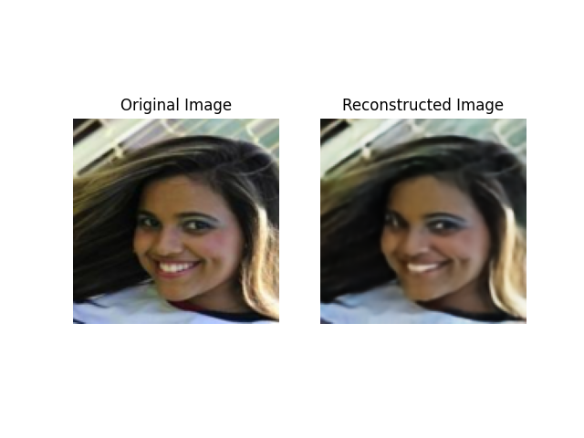

# Latent Space Modeling with PixelCNN for VQ-VAE

This project demonstrates how to use a PixelCNN model to autoregressively model the latent space of a VQ-VAE. The objective is to generate high-quality samples by learning the distribution of latent codes produced by the VQ-VAE using PixelCNN.

## Table of Contents
- [Overview](#overview)
- [Features](#features)
- [Installation](#installation)
- [Usage](#usage)
- [Results](#results)
- [Contributing](#contributing)

## Overview
This repository contains an implementation of a PixelCNN model that is trained to model the distribution of latent codes from a VQ-VAE. The goal is to generate new samples by modeling the latent space distribution and using the VQ-VAE decoder to reconstruct images.

## Features
- **VQ-VAE Latent Code Generation**: Use VQ-VAE to encode images into discrete latent codes.
- **PixelCNN-Based Modeling**: A PixelCNN model for autoregressively modeling the latent space.
- **Autoregressive Sampling**: Generate new latent codes, which can then be decoded by the VQ-VAE to create new images.
- **Multiscale Modeling**: PixelCNN processes latent codes spatially to capture spatial dependencies and model relationships between codes.

## Installation
1. Clone the repository:
   ```bash
   git clone https://github.com/likithpala7/VQ-VAE.git
   cd VQ-VAE
   ```
2. Install the required dependencies:
    ```bash
    pip install -r requirements.txt
    ```

## Usage
1. To train the VQ-VAE, run this commmand:
    ```bash
    python train_script.py
    ```
    You can adjust the parameters in the file depending on the dataset you are using.
2. To train the PixelCNN, run this command:
    ```bash
    python train_pixelcnn.py
    ```
    Similarly, you can adjust any of the parameters in this file to change the parameters of the PixelCNN model.
3. To reconstruct 10 random images and save them, run this command:
    ```bash
    python reconstruction_script.py
    ```
4. To generate images using codebook indices that were sampled randomly, run this command:
    ```bash
    python random_sample.py
    ```
    Note that the images are supposed to look abstract as this is a complete random sample.
5. To generate images using the trained PixelCNN model, run this command:
    ```bash
    python generation_script.py
    ```
    This will generate images, using the distribution that the PixelCNN model learned.

# Results
Once trained, the PixelCNN can autoregressively generate new latent grids that represent coherent data distributions in the latent space of the VQ-VAE. The VQ-VAE decoder can then transform these grids back into image space.

Here are some example images generated from the model:

### Reconstructed Images

The VQ-VAE performs a lot better in comparison to the VAE that I trained on the same dataset. This is due to the fact that the VQ-VAE maps the data distribution to discrete values in the latent space, whereas a VAE maps it to continuous values. This makes it harder to generate samples for a VQ-VAE since you have to train another model (a PixelCNN in this case) to learn the distribution of the latent codes.




### Randomly Generated Images

Generating images by selecting random latent codes and passing them through the VQ-VAE decoder doesn't result in meaningful images, but it helps to understand that most of the codes don't mean anything by themselves. There is a distribution of the codes that changes depending on the codes around it. This is precisely what we are modeling when we train a PixelCNN. Samples images from the latent space of a VAE would result in meaningful images since the latent space is meaningful.


### Images Generated by PixelCNN

I used a PixelCNN to model the distribution of the latent codes found by the VQ-VAE. I tried different training strategies including using attention in the PixelCNN and using a transformer to model the sequence of latent codes in the images. These were not successful attempts and resulted in the decoder generating images that were all pink. As evident in these examples, the PixelCNN was somewhat successful in modeling the latent codes, although there is a lot of work that could be done to improve the model.


# Contributing
We welcome contributions! Feel free to open issues or submit pull requests to help improve this project.