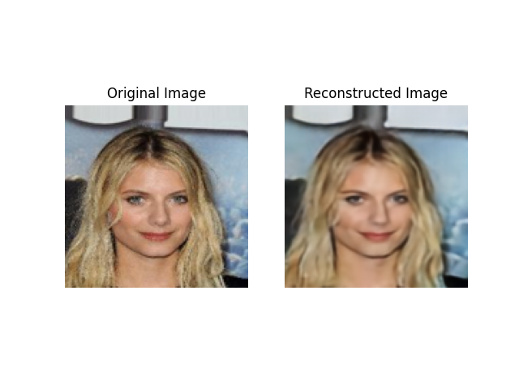

# Latent Space Modeling with PixelCNN for VQ-VAE

This project demonstrates how to use a PixelCNN model to autoregressively model the latent space of a VQ-VAE. The objective is to generate high-quality samples by learning the distribution of latent codes produced by the VQ-VAE using PixelCNN.

## Table of Contents
- [Overview](#overview)
- [Features](#features)
- [Installation](#installation)
- [Usage](#usage)
  - [Training the PixelCNN](#training-the-pixelcnn)
  - [Generating Samples](#generating-samples)
- [Model Architecture](#model-architecture)
- [Results](#results)
- [Contributing](#contributing)
- [License](#license)

## Overview
This repository contains an implementation of a PixelCNN model that is trained to model the distribution of latent codes from a VQ-VAE. The goal is to generate new samples by modeling the latent space distribution and using the VQ-VAE decoder to reconstruct images.

## Features
- **VQ-VAE Latent Code Generation**: Use VQ-VAE to encode images into discrete latent codes.
- **PixelCNN-Based Modeling**: A PixelCNN model for autoregressively modeling the latent space.
- **Autoregressive Sampling**: Generate new latent codes, which can then be decoded by the VQ-VAE to create new images.
- **Multiscale Modeling**: PixelCNN processes latent codes spatially to capture spatial dependencies and model relationships between codes.

## Installation
1. Clone the repository:
   ```bash
   git clone https://github.com/your-username/latent-pixelcnn-vqvae.git
   cd latent-pixelcnn-vqvae
2. Install the required dependencies:
    ```bash
    pip install -r requirements.txt

Usage
Training the PixelCNN
Prepare Latent Codes: Train a VQ-VAE on your dataset and encode the images into discrete latent codes. These latent codes should be stored in a format suitable for training (e.g., latent codes of shape [batch_size, 32, 32] for a 32x32 latent space).

Train the PixelCNN Model: You can train the PixelCNN to autoregressively model the latent codes by running the training loop in pixelcnn_model.py:

python
Copy code
import torch
from pixelcnn_model import PixelCNN

# Define hyperparameters
latent_dim = 512       # Number of unique latent codes
image_size = 32        # Spatial size of the latent space (e.g., 32x32)
num_blocks = 10        # Number of residual blocks in the PixelCNN

# Initialize the model
model = PixelCNN(latent_dim=latent_dim, image_size=image_size, num_blocks=num_blocks)

# Train the model
model.train()  # Implement your training loop (see training section below)
Training Loop: Implement a standard training loop using cross-entropy loss to predict the next latent code for each pixel based on previous ones. The PixelCNN operates over the entire latent grid (32x32) to predict the latent code for each position in the grid.

Generating Samples
Once the PixelCNN is trained, you can autoregressively sample from it to generate new latent sequences. These can then be passed through the VQ-VAE decoder to produce new images.

python
Copy code
# Example of sampling from PixelCNN and decoding using VQ-VAE
latent_grid = model.generate(start_sequence, image_size=32)
generated_image = vqvae_decoder.decode(latent_grid)
Model Architecture
The PixelCNN model consists of:

Embedding Layer: Encodes each latent code into an embedding vector.
Gated Residual Blocks: A series of gated convolutional layers that autoregressively model the spatial dependencies between latent codes.
Logits Output: Outputs logits representing the probability distribution over possible latent codes for each pixel in the grid.
Model Hyperparameters
Latent Dimension: Number of unique latent codes (e.g., 512).
Image Size: Size of the latent grid (e.g., 32x32).
Number of Blocks: Number of residual blocks in the PixelCNN.
Kernel Size: Size of the convolutional kernels used in each residual block (e.g., 3x3).
Results
Once trained, the PixelCNN can autoregressively generate new latent grids that represent coherent data distributions in the latent space of the VQ-VAE. The VQ-VAE decoder can then transform these grids back into image space.

Here are some example images generated from the model:

### Reconstructed Images





### Randomly Generated Images


### Images Generated by PixeLCNN


Contributing
We welcome contributions! Feel free to open issues or submit pull requests to help improve this project. Here's how you can contribute:

Report bugs or suggest features by opening an issue.
Submit code improvements or new features by opening a pull request.
License
This project is licensed under the MIT License. See the LICENSE file for details.